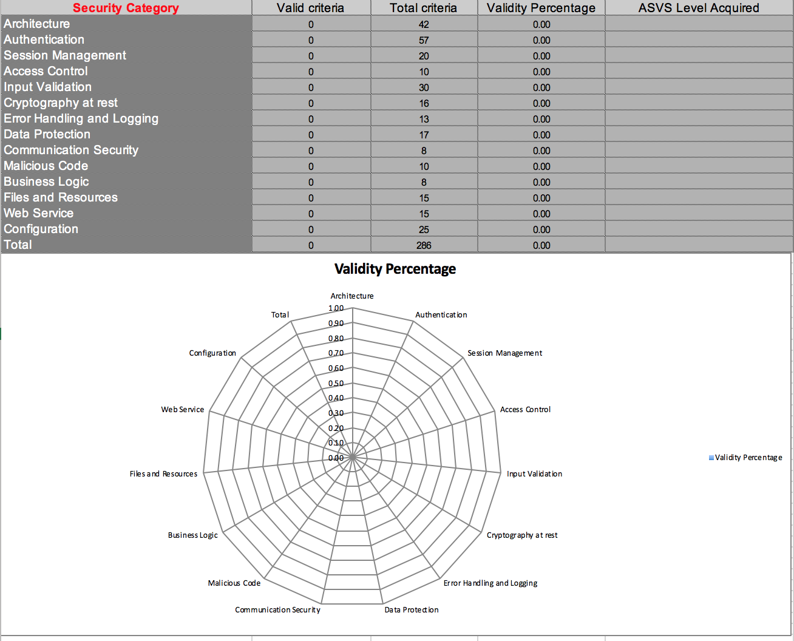

# OWASP ASVS checklist for audits

## Contributors
@shenril (Batard Florent - http://code-artisan.io)

@lyz-code

@emilva

@REslim30

## OWASP ASVS

A checklist to help you apply the [OWASP ASVS](https://www.owasp.org/index.php/Category:OWASP_Application_Security_Verification_Standard_Project) in a more efficient and simpler way.

This checklist is compatible with [ASVS version 4.0.2](https://github.com/OWASP/ASVS/raw/v4.0.2/4.0/OWASP%20Application%20Security%20Verification%20Standard%204.0.2-en.pdf) and can be found:

- [OWASP ASVS Checklist (Excel)](https://github.com/shenril/owasp-asvs-checklist/raw/master/ASVS-checklist-en.xlsx)
- [OWASP ASVS Checklist (OpenDocument)](https://github.com/shenril/owasp-asvs-checklist/raw/master/ASVS-checklist-en.ods)

Older versions of the checklist are also available in the [**Release**](https://github.com/shenril/owasp-asvs-checklist/releases) section.

Once the checklist filled you can display a summary graph on the Project

