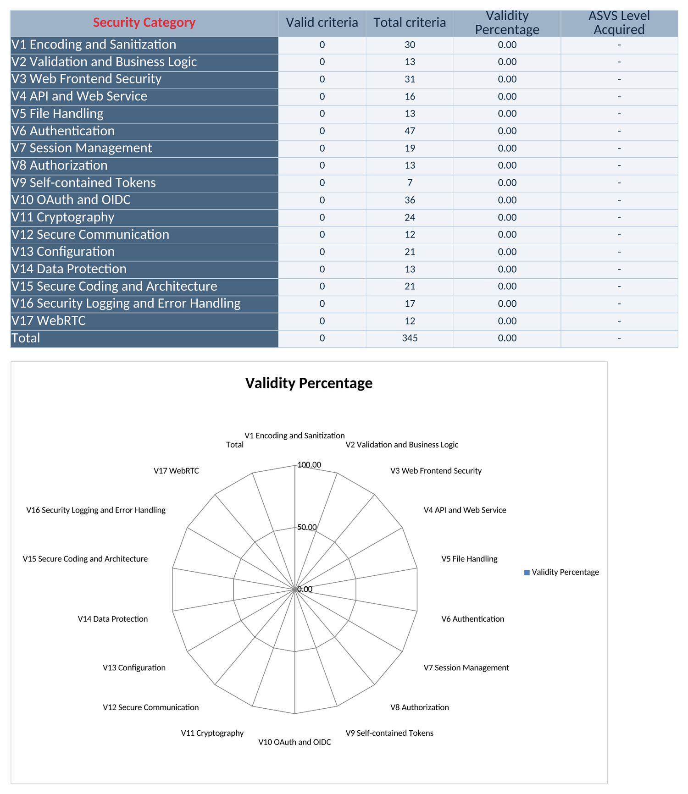

# OWASP ASVS checklist for audits

## Contributors
@shenril (Batard Florent - https://bluesquadron.dev)

@lyz-code

@emilva

@REslim30

## OWASP ASVS

A checklist to help you apply the [OWASP ASVS](https://owasp.org/www-project-application-security-verification-standard/) in a more efficient and simpler way.

This checklist is compatible with [ASVS version 5.0.0](https://github.com/OWASP/ASVS/releases/download/v5.0.0_release/OWASP_Application_Security_Verification_Standard_5.0.0_en.pdf) and can be found:

- [OWASP ASVS Checklist (Excel)](https://github.com/shenril/owasp-asvs-checklist/raw/master/ASVS-checklist-en.xlsx)
- [OWASP ASVS Checklist (OpenDocument)](https://github.com/shenril/owasp-asvs-checklist/raw/master/ASVS-checklist-en.ods)

Older versions of the checklist are also available in the [**Release**](https://github.com/shenril/owasp-asvs-checklist/releases) section.

Once the checklist filled you can display a summary graph on the Project



## What changed in 5.0.0

ASVS 5.0.0 is a restructure, not a refresh: the standard went from 14 to **17 chapters**,
from 286 to **345 requirements**, and every requirement was renumbered. One sheet per chapter:

| Sheet | Requirements | Sheet | Requirements |
| --- | ---: | --- | ---: |
| V1 Encoding and Sanitization | 30 | V10 OAuth and OIDC | 36 |
| V2 Validation and Business Logic | 13 | V11 Cryptography | 24 |
| V3 Web Frontend Security | 31 | V12 Secure Communication | 12 |
| V4 API and Web Service | 16 | V13 Configuration | 21 |
| V5 File Handling | 13 | V14 Data Protection | 13 |
| V6 Authentication | 47 | V15 Secure Coding and Architecture | 21 |
| V7 Session Management | 19 | V16 Security Logging and Error Handling | 17 |
| V8 Authorization | 13 | V17 WebRTC | 12 |
| V9 Self-contained Tokens | 7 | | |

If you are migrating a partially filled 4.0.3 checklist, OWASP publishes an official
requirement-by-requirement correspondence in
[`mapping_v4.0.3_to_v5.0.0.yml`](https://github.com/OWASP/ASVS/blob/v5.0.0_release/5.0/mappings/mapping_v4.0.3_to_v5.0.0.yml).

The `ASVS Results` sheet now also computes the **ASVS Level Acquired** per chapter: the highest
level whose requirements are all marked `Valid`, ignoring the ones marked `Not Applicable`.

### About the CWE and NIST columns

ASVS 5.0.0 removed the CWE and NIST columns from its requirement exports. The values in this
checklist are recovered from the mapping files shipped with the 5.0.0 release
([`v5.0.be_cwe_mapping.json`](https://github.com/OWASP/ASVS/blob/v5.0.0_release/5.0/mappings/v5.0.be_cwe_mapping.json)
and [`nist.md`](https://github.com/OWASP/ASVS/blob/v5.0.0_release/5.0/mappings/nist.md)), joined
to the released numbering through
[`mapping_v5.0.be_to_v5.0.0.yml`](https://github.com/OWASP/ASVS/blob/v5.0.0_release/5.0/mappings/mapping_v5.0.be_to_v5.0.0.yml).
Coverage is therefore partial by construction — **204 of 345** requirements carry a CWE and **32**
carry a NIST reference. Requirements with no published mapping are left blank rather than guessed.

## Regenerating the checklist

Both artifacts are generated from the official OWASP ASVS release data:

```bash
pip install openpyxl
python3 tools/build_checklist.py --verify
```

See [`tools/README.md`](./tools/README.md) for details.
